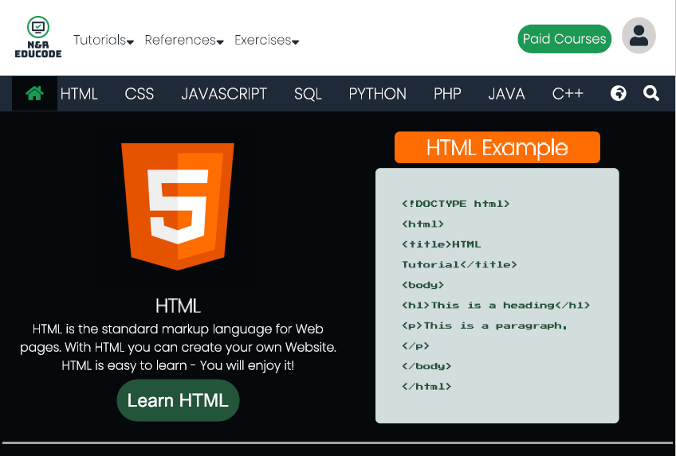
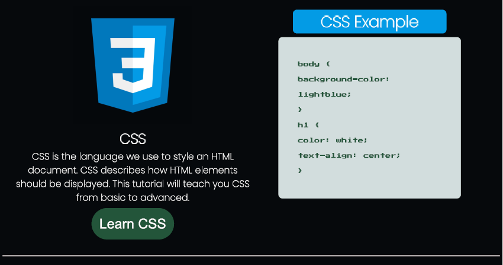
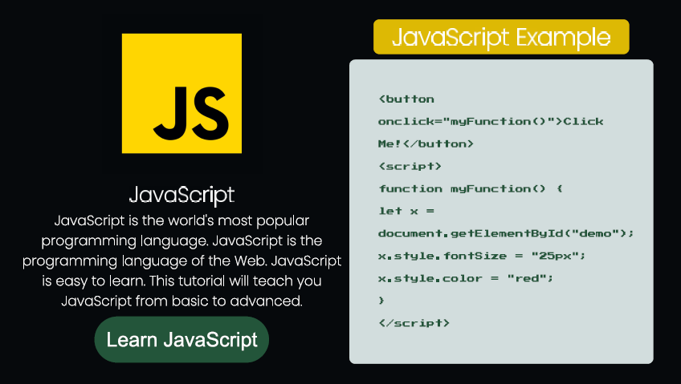
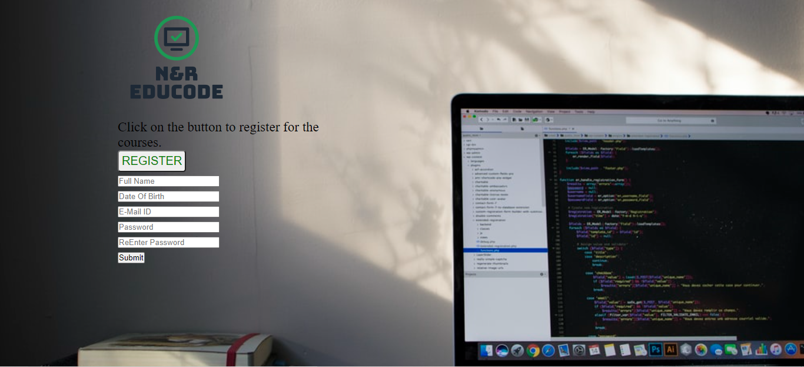

# N&R EDUCODE (DOM Website)

## TABLE OF CONTENTS

- [General Information](https://github.com/Rayr8/Dom-Wesbite-Project#general-information)
- [Programming Languages Used](https://github.com/Rayr8/Dom-Wesbite-Project#programming-languages-used)
- [Features](https://github.com/Rayr8/Dom-Wesbite-Project#features)
- [Screenshots](https://github.com/Rayr8/Dom-Wesbite-Project#screenshots)
- [Live Demo](https://github.com/Rayr8/Dom-Wesbite-Project#live-demo)
- [Setup](https://github.com/Rayr8/Dom-Wesbite-Project#setup)
- [Usage](https://github.com/Rayr8/Dom-Wesbite-Project#usage)
- [Contributing](https://github.com/Rayr8/Dom-Wesbite-Project#contributing)
- [Project Status](https://github.com/Rayr8/Dom-Wesbite-Project#project-status)
- [Authors](https://github.com/Rayr8/Dom-Wesbite-Project#authors)
- [Acknowledgments](https://github.com/Rayr8/Dom-Wesbite-Project#acknowledgements)

## GENERAL INFORMATION

N&R EDUCODE is a basic website to familiarise and practice adding elements dynamically to the webpage with Javascript using DOM Manipulation. Intermediate HTML, CSS, JavaScript and ES6 Modules were used. This website code was written using Visual Studio Code.

## LANGUAGES USED

- HTML
- CSS
- JavaScript ES6

## FEATURES

All the features below were created with DOM Manipulation:
- Home page with icons 
- Navigation bar
- Registration form with onclick button 

## SCREENSHOTS

 

## LIVE DEMO

[Live Demo Link]()

## SETUP

#### Getting Started

To get a local copy up and running clone or download this repository to your local workstation.

#### Prerequisites

Visual Studio Code (or a code editor of your choice)

## USAGE

Enter the directory where you cloned or downloaded the project and open index.html using your favourite browser.

## CONTRIBUTING

**Contributions, issues and feature requests are welcome.**

*If you see something wrong or not working, please check the issue tracker section, if that problem you met is not in already opened issues then open the issue by clicking on new issue button.* 

*If you have a solution to that, and you are willing to work on it, follow the below steps to contribute:* 

*a) Fork this repository.* 

*b) Clone it on your local computer by running https://github.com/Rayr8/.git.* 

*c) Replace Rayr8 with the username you use on github.* 

*d) Open the cloned repository which appears as a folder on your local computer with your favorite code editor.* 

*e) Create a separate branch off the master branch.* 

*f) Write your codes that will fix the issue you found.*

*g) Commit and push the branch you created.*

*h) Raise a pull request, comparing your new created branch with our original master branch.*

## PROJECT STATUS 

The project is completed. 

Give us a :star: if you like this project!

## AUTHORS

- :bust_in_silhouette: **Raeesah Ismail** 
  - GitHub: [@Rayr8](https://github.com/Rayr8)

- :bust_in_silhouette: **Natasha Chitongo** 
  - GitHub: [@natashac18](https://github.com/natashac18)

## ACKNOWLEDGEMENTS

- Girlcode
- [Rumbie-Mudzie7](https://github.com/Rumbie-Mudzie7)
- W3schools
